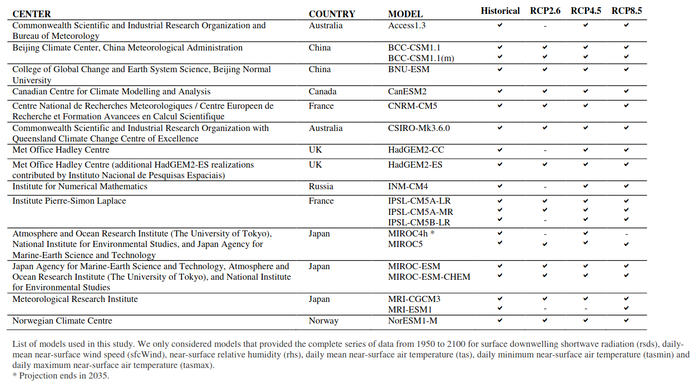

# Abstract

This paper discusses how ML can be used to reduce GHG emissions and help society adapt to changing climate. It flags the proposed solutions into levels of implement-ability based on current technology trends as : 
1. High leverage : bottlenecks that are best suited to be solved by ML
2. Long term : Applications that will have their primary impact after 2040. 
3. Uncertain impact : Impact on GHG emissions is uncertain. 

# Buildings and Cities

Energy consumed in buildings is responsible for a quarter of global energy-related emissions. [@moraGlobalRiskDeadly2017]  [@moraTwentySevenWaysHeat2017] describe the health risks associated with exposure to heat that exceeds human thermoregulatory capacity. 

## DataSets

|DOI|Dataset|Data|Algorithms|Remarks|
|--|----------------------|----------------------|----------------------|----------------------|
|10.1038/nclimate3322 |[Government Websites](#earth-system-models)|<ol><li> daily mean near-surface wind speed </li> <li> daily mean near-surface relative humidity </li> <li>daily mean/min/max near-surface air temperature</li></ol>|<ol><li>[[Support Vector Machines]] with 16 variables to discriminate climate conditions between hot days and cold days</li></ol>|Model with mean daily relative humidity and mean daily surface air temperature yielded highest relative accuracy of any two pairs of variables| 
|test||test|

### Supplementary Images
#### Earth System Models

